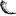

<!-- Presentation Block -->

 

<h2 align="center">qBittorrent Search Plugins</h2>

      A growing collection of search plugins for qBittorrent, an awesome open-source torrent client.
  

 
   

<!-- ToC -->

  
Table of Contents

  <ol>
    <li>
      <a href="#book-about-the-project">📖 About The Project</a>
    </li>
    <li>
      <a href="#gear-getting-started">⚙️ Getting Started</a>
      <ul>
        <li><a href="#installation">Installation</a></li>
        <li><a href="#plugin-list">Plugin List</a></li>
        <li><a href="#notes">Notes</a></li>
        <li><a href="#developer-notes">Developer Notes</a></li>
      </ul>
    </li>
    <li><a href="#dizzy-contributing">💫 Contributing</a></li>
    <li><a href="#handshake-support">🤝 Support</a></li>
    <li><a href="#warning-license">⚠️ License</a></li>
    <li><a href="#hammer_and_wrench-built-with">🛠️ Built With</a></li>
  </ol>

<!-- About Block -->

## :book: About The Project

This repository contains various search engine plugins that I developed for qBittorrent, an amazing open-source torrent client.

If you would like to request a specific plugin, or if an existing one stops working, please let me know by opening an issue.

(<a href="#readme-top">back to top</a>)

<!-- Setup Block -->

## :gear: Getting Started

These plugins are unofficial, so they must be installed manually.

Due to how qBittorrent handles plugins, you must periodically check this repository for updates or wait until a plugin stops working.

_If you would like to improve this behavior, please help reach the qBittorrent developers by upvoting: [Improve Plugin Manager behavior](https://github.com/qbittorrent/qBittorrent/issues/17445)_

(<a href="#readme-top">back to top</a>)

### Installation

There are two ways to install unofficial plugins:

- The easiest way is to copy the link from the "Download" column in the table below and use it as a "web link" in qBittorrent.
- Alternatively, you can open the download link and save the document locally as a **Python file** (`.py`). Then, you can install the plugin by selecting the file from your filesystem.

Some plugins may require additional settings to work properly, so please read the _Notes_ section carefully.

If you have any questions about the installation process, please refer to the official wiki: [Install search plugins](https://github.com/qbittorrent/search-plugins/wiki/Install-search-plugins).

(<a href="#readme-top">back to top</a>)

### Plugin List

| Plugin                                                                   | Type          | Version (Updated)        |         Working?         |                                                                                                                                                                                                        Download                                                                                                                                                                                                        |
| :------------------------------------------------------------------------- | :-------------- | :------------------------- | :------------------------: | :-----------------------------------------------------------------------------------------------------------------------------------------------------------------------------------------------------------------------------------------------------------------------------------------------------------------------------------------------------------------------------------------------------------------------: |
|  AcademicTorrents | Torrent Index | **1.4** - _(10/04/2026)_ |    :heavy_check_mark:    |                                                                                                                                                            |
|  BitSearch                      | Torrent Index | **1.0** - _(25/02/2025)_ |    :heavy_check_mark:    |                                                                                                                                                                    |
|  BT4G                                     | Torrent Index | **1.0** - _(25/02/2025)_ |    :heavy_check_mark:    |                                                                                                                                                                        |
|  btetree                            | Torrent Index | **1.3** - _(19/03/2023)_ |    :heavy_check_mark:    |                                                                                                                                                                      |
|  CloudTorrents          | Torrent Index | **1.0** - _(25/02/2025)_ |    :heavy_check_mark:    |                                                                                                                                                                |
|  ETTV                                     | Torrent Index | **1.2** - _(17/06/2021)_ | :heavy_multiplication_x: |                                                                                 Site down:cry:                                                                                  |
|  FileMood                         | Torrent Index | **1.0** - _(25/02/2025)_ |    :heavy_check_mark:    |                                                                                                                                                                    |
|  GloTorrents                | Torrent Index | **1.6** - _(19/03/2023)_ |    :heavy_check_mark:    |                                                                                                                                                                  |
|  IlCorsaroNero          | Torrent Index | **1.8** - _(27/10/2024)_ |    :heavy_check_mark:    |                                                                                                                                                                |
|  Kickasstorrents    | Torrent Index | **1.2** - _(22/02/2026)_ |        :question:        | KATCR uses Cloudflare; the plugin will not work when CF protection is active. It is unstable and only works when CF is set to low threats.  |
|  LimeTorrents             | Torrent Index | **1.1** - _(21/06/2025)_ |    :heavy_check_mark:    |                                                                                                                                                                |
|  Nitro                                  | Torrent Index | **1.0** - _(29/07/2022)_ | :heavy_multiplication_x: |                                                                   Site down since 09/11/22:cry:                                                                    |
|  Pirateiro                      | Aggregator    | **1.1** - _(23/11/2023)_ | :heavy_multiplication_x: |                                                                   Sometimes it doesn't work                                                                    |
|  RARBG                                  | Torrent Index | **1.1** - _(06/12/2021)_ | :heavy_multiplication_x: |                                                                                Site down:cry:                                                                                 |
|  RockBox                            | Torrent Index | **1.1** - _(19/03/2023)_ |    :heavy_check_mark:    |                                                                                                                                                                      |
|  Snowfl                               | Aggregator    | **1.3** - _(28/07/2022)_ |    :heavy_check_mark:    |                                                                                                                                                                      |
|  ThePirateBay             | Torrent Index | **1.1** - _(19/03/2023)_ |    :heavy_check_mark:    |                                                                                                                                                                |
|  TNTVillageDump       | Static Dump   | **1.1** - _(31/01/2022)_ |    :heavy_check_mark:    |                                                                                                                                                              |
|  TorrentDownload    | Aggregator    | **1.1** - _(23/11/2023)_ |    :heavy_check_mark:    |                                                                                                                                                              |
|  TorrentQuest             | Torrent Index | **1.0** - _(25/02/2025)_ |    :heavy_check_mark:    |                                                                                                                                                                |
|  YourBittorrent       | Torrent Index | **1.3** - _(22/02/2022)_ |    :heavy_check_mark:    |                                                                                                                                                              |

(<a href="#readme-top">back to top</a>)

### Notes

- **IlCorsaroNero** has been blacklisted on Italy's DNS. Please **use a different DNS such as Google or Cloudflare**.
- **AcademicTorrents** please set "Search in" properly!
- **Torrent aggregators** mix multiple torrent indexes. I tried to implement the most generic torrent/magnet fetching, but sometimes it fails.
- **RARBG** uses an anti-spam system. Most of the time my implementation will not work, use the official plugin based on torrentapi.
- **TNTVillage** uses an embedded dump, making the plugin quite large (~20MB)!
- **YourBittorrent** by default only shows 50 torrents based on your query. I tried to force pagination, but it causes duplicate results. Please use specific queries!

(<a href="#readme-top">back to top</a>)

### Developer Notes

If you want to create a new search engine, please refer to the [official wiki](https://github.com/qbittorrent/search-plugins/wiki/How-to-write-a-search-plugin#python-class-file-structure) and place it inside `/src/engines`.

For convenience, I have included the `nova` testing scripts provided by the developers:

1. `cd ./src`
2. `python ./nova2.py <search_engine> <category> <search keywords>`

(<a href="#readme-top">back to top</a>)

<!-- Contribute Block -->

## :dizzy: Contributing

If you are interested in contributing, please refer to [Contributing Guidelines](.github/CONTRIBUTING.md) for more
information and take a look at open issues. Ask any questions you may have and you will be provided guidance on how to
get started.

Thank you for considering contributing.

(<a href="#readme-top">back to top</a>)

<!-- Support Block -->

## :handshake: Support

If you find value in my work, please consider making a donation to help me create, and improve my projects.

Your donation will go a long way in helping me continue to create free software that can benefit people around the
world.

(<a href="#readme-top">back to top</a>)

<!-- License Block -->

## :warning: License

The content of this repository, except the nova scripts by qBittorrent devs, is distributed under the GNU GPL-3.0
License. See `LICENSE` for more information.

(<a href="#readme-top">back to top</a>)

<!-- Built With Block -->

## :hammer_and_wrench: Built With

- [Python](https://www.python.org/)
- [Regex](https://en.wikipedia.org/wiki/Regular_expression)

(<a href="#readme-top">back to top</a>)

